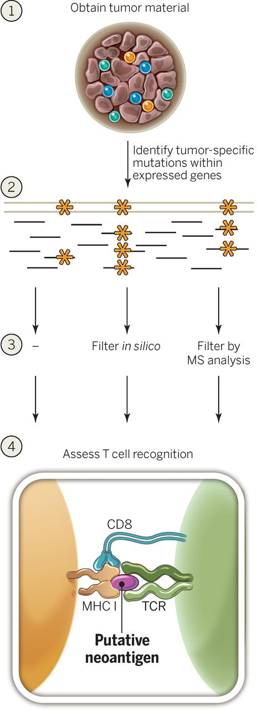
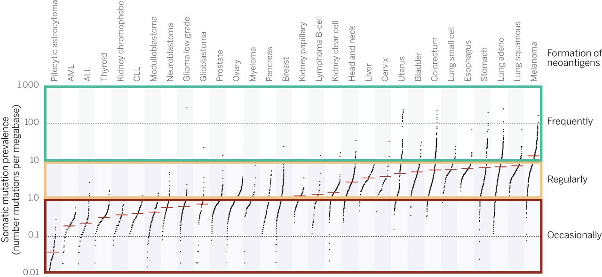

# 🏺 Tumor neoantigen identification <!-- omit in toc --> 

## NAG - a pVACtools wrapper for neoantigen prediction

### Installation

Refer to [install_readme.sh](install_readme.sh) for instructions.

Load with:

```
$ export PATH=/g/data/gx8/extras/umccrise_2020_Sep/miniconda/envs/umccrise_neoantigens/bin:$PATH
```

### Usage

```
$ nag -v SOMATIC.VCF \
      -s SAMPLE_NAME \
      -O OPTITYPE_FILE \
      -R BCBIO_RNA_RUN \
      -r BCBIO_RNA_SAMPLE_NAME \
      -o OUTPUT_DIR \
      [-j N]

# Example:
$ nag -v /g/data/gx8/projects/Saveliev_APGI/LTS/results/umccrised/APGI_2121/small_variants/APGI_2121-somatic-PASS.vcf.gz \
      -s APGI_2121 \
      -O /g/data/gx8/projects/Saveliev_APGI/LTS/results/umccrised/APGI_2121/hla/APGI_2121_tumor_result.tsv \
      -R /g/data/gx8/projects/Saveliev_APGI/LTS/RNA/full_rnaseq_rerun \
      -r APGI_2121 \
      -o nag_results \
      -j 4

# Example. Run pVACseq only:
$ nag -v /g/data/gx8/projects/Saveliev_APGI/LTS/results/umccrised/APGI_2121/small_variants/APGI_2121-somatic-PASS.vcf.gz \
      -s APGI_2121 \
      -O /g/data/gx8/projects/Saveliev_APGI/LTS/results/umccrised/APGI_2121/hla/APGI_2121_tumor_result.tsv \
      -o nag_results_seq \
      -S seq \
      -j 4
```

### Usage in umccrise

```
$ source /g/data/gx8/extras/umccrise_2020_Sep/load_umccrise.sh
$ umccrise umccrise.tsv -S neoantigens -o results

where `umccrise.tsv` is a tab-separated file like the following:
sample  wgs     normal  exome   exome_normal    rna     rna_bcbio       rna_sample
APGI_2121       /g/data/gx8/projects/Saveliev_APGI/LTS/2018-11-30-hg38/final/LTS_APGI_2121_T/LTS_APGI_2121_T-ready.bam  /g/data/gx8/projects/Saveliev_APGI/LTS/2018-11-30-hg38/final/LTS_APGI_2121_N/LTS_APGI_2121_N-ready.bam  /g/data/gx8/projects/Saveliev_APGI/APGI_varcall_bcbio/exomes_prio123456/final/APGI_2121_tumor/APGI_2121_tumor-ready.bam /g/data/gx8/projects/Saveliev_APGI/APGI_varcall_bcbio/exomes_prio123456/final/APGI_2121_normal/APGI_2121_normal-ready.bam       /g/data/gx8/projects/Saveliev_APGI/LTS/RNA/full_rnaseq_rerun/final/APGI_2121/APGI_2121-ready.bam        /g/data/gx8/projects/Saveliev_APGI/LTS/RNA/full_rnaseq_rerun    APGI_2121
```


## Introduction

_Tumor neoantigen_ is a peptide that displays on the tumor cell surface that could be specifically recognized by neoantigen-specific T cell receptors (TCRs) in the context of major histocompatibility complexes (MHCs). From an immunological perspective, tumor neoantigen is the truly foreign protein and entirely absent from normal human organs/tissues. Tumor neoantigens could derive from nonsynonymous genetic alterations, including:

* small somatic variants: single-nucleotide variants (SNVs), insertions, or deletions (indel),
* gene fusions,
* viral integration events.

By analysing NGS data, one can attempt to reconstruct such peptide sequences in-silico. This opens up multiple opportinities:

* one can use putative neoantigen peptide sequences to guide personalised cancer vaccines design;
* one can define a metric "tumor neoantigen burden" (TNB) derived from neoantigen abundancy and/or quality that would relate to the the immune system activity in cancer suppression. It can be used, for example, to:
    * predict clinical outcomes to immune checkpoint blockade
    * better understand mechanisms that lead to tumor suppression and escape, and explain patient survival

From the biological point of view, the antigen processing involves the following steps:

* Shredding of proteins within the cytoplasm by the proteasome (specifically, a proteasomal complex induced by IFN-γ called "immunoproteasome", which is primarily responsible for the degradation of proteins into peptides that are optimal in size for MHC binding), 
* Transportation of the peptides to the endoplasmic reticulum via the transporter associated with antigen processing (TAP) proteins
* On the cell surface, the peptides are displayed on major histocompatibility complexes (MHCs). Binding affinity to the human leukocyte antigen HLA proteins making up the MHC complex is the most crucial stage that defines the neoantigen potency. There are 2 classical types of MHC: MHC class I is encoded by HLA-A, HLA-B and HLA-C genes, and binds antigens of 8–11 amino acids in length; MHC class II is encoded by HLA-DR, HLA-DQ and HLA-DP, that binds antigens of 11–20 amino acids in length. Non-classical MHC molecules also exist. 
* Cytotoxic T cells recognise the resulting peptide-MHC compound, which activates the immune T cell response. MHC I is regognised by cytotoxic CD8+ T cells, MHC II is recognised by CD4+ T cells.



## Deriving neoantigens in silico

From the computational point of view, steps to identify potent neoantigen peptides are the following:

* Use sequencing data to identify somatic alterations, such as:
    * Small variants from whole genome (WGS) or whole exome (WES) sequencing data (which includes the alignment to the human refernece genome and calling variants using tools like Strelka, MuTect, VarDict, DRAGEN),
    * Gene fusions from RNAseq data (which includes aligning or pseudoaligning to the human transcriptome, and calling events using tools like Pizzly or Arriba) or from WGS data (using tools like Manta and GRIDSS),
    * Use unmapped and partially mapped reads to identify viral integrations from WGS or RNAseq data.
* From the events above, derive candidate peptides by translating sequences around the small variants, fusion junctions, or in ORFs of oncoviruses, to protein sequences.
* From WGS or WES data, identify the specific HLA alleles that encode MHC class I and II, molecules by analysing the reads mapping to an HLA cluster of genes on chromosome 6. The MHC alleles are remarkably diverse and the number of potential peptides processed from a given pathogen or tumor is also large, with a small minority actually binding to the MHC. This makes predicting which peptides will bind MHC challenging. Optitype is a common tool for MHC class I alleles. Predicting MHC II epitopes is a more difficult challenge, however [HLA-LA](https://github.com/DiltheyLab/HLA-LA) attempts to handle it.
* Score the peptides based on 3 basic features:
    * Abundance (expression, allelic frequency, clonality, binding affinity, C terminal cleavage, transport efficiency)
        * Calculate the expression of candidate peptides using tools like kallisto,
        * Calcualte clonality (percentage of tumor cells containing the identified neoantigen) using PURPLE or PyClone, though in principal expression should be sufficient,
        * Calcualte binding affinity to the corresponding MHC molecules using the predicted HLA type (using tools like NetMHC),
        * Calculate the proteasomal C terminal cleavage, which is the probablity that 9-11 base long peptides (epitopes) will be produced (tools like NetChop, or NetCTL/NetCTLpan that score it together with MHC affinity)
        * Calculate the TAP transport efficiency, which is the chance that those 9-11 base long epitopes will be transported to the cell surface (tools like NetChop, or NetCTL/NetCTLpan that score it together with MHC affinity)
    * Peptide dissimilarity (negative selection against cross-reacting T cells)
        * For peptides derived from small variants,  also score the wild type counterpart in order filter out those where the wild type also scores high, to avoid self-immunity,
    * T cell recognition probability
        * Score the peptide hydrophobicity of amino acids at T cell receptor (using sources like *[IEDB](http://www.iedb.org/)))
        * Score the T cell recognition probability of the peptide-MHC complex (probability that a neoantigen will be recognized by the TCR repertoire, by alignment with a set of peptides retrieved from *[IEDB](http://www.iedb.org/)))
* Finally, depending on the goal of study,
	* Calculate the tumor neoantigen burden (TNB) metric by either taking the highest score among peptides, or somehow summarize scores of all potent peptides.
	* Use potent peptides to design a vaccine for testing in vitro. 
 

## Tools

### MHC binding prediction methods

Most in silico epitope binding prediction methods employ various computational approaches such as Artificial Neural Networks (ANN) and Support Vector Machines (SVM) and are trained on binding to different HLA class I alleles to effectively identify putative T cell epitopes. Allele-specific software like NetMHC perform better compared to pan-specific methods such as NetMHCpan in case of well-characterized alleles due to availability of large amounts of training data. However, pan-specific methods could be beneficial in cases where there is limited peptide binding data for training, for arbitrary HLA molecules, or when predicting epitopes for non-human species.

* MHC class I predictors: SMM, SMMPMBEC, Pickpocket, NetMHC, NetMHCpan, NetMHCcons, MHCflurry, MHCnuggets, MHCSeqNet, EDGE
* MHC class II predictors: SMMAlign, NNAlign, ProPred, NetMHCII and NetMHCIIpan, TEPITOPE, TEPITOPEpan, RANKPEP, MultiRTA, OWA-PSSM.

### Peptide processing methods

* NetChop20S, NetChopCterm, ProteaSMM, PAProC (MHC class I), PepCleaveCD4 (MHC class II)


### HLA typing tools

* MHC class I: Optitype, Polysolver
* MHC class I and II: HLA-LA, Athlates, HLAreporter, HLAminer, HLAscan, HLA-VBSeq, PHLAT, seq2HLA, xHLA

### Ranking tools

There are also existing tools and databases ([IEDB](http://www.ncbi.nlm.nih.gov/entrez/query.fcgi?cmd=Retrieve&db=PubMed&dopt=Abstract&list_uids=25300482), [EpiBot](http://www.ncbi.nlm.nih.gov/entrez/query.fcgi?cmd=Retrieve&db=PubMed&dopt=Abstract&list_uids=25905908), [EpiToolKit](http://www.ncbi.nlm.nih.gov/entrez/query.fcgi?cmd=Retrieve&db=PubMed&dopt=Abstract&list_uids=25712691)) that compile the results generated from individual epitope prediction algorithms to improve the prediction accuracy with consensus methods or a unified final ranking. EpiToolKit also has the added functionality of incorporating sequencing variants in its Galaxy-like epitope prediction workflow (via its Polymorphic Epitope Prediction plugin). However, it does not incorporate sequence read coverage or gene expression information available, nor can it compare the binding affinity of the peptide in the normal sample (WT) versus the tumor (mutant). Another multi-step workflow [Epi-Seq](http://www.ncbi.nlm.nih.gov/entrez/query.fcgi?cmd=Retrieve&db=PubMed&dopt=Abstract&list_uids=25245761) uses only raw RNA-Seq tumor sample reads for variant calling and predicting tumor-specific expressed epitopes.

#### [pVACtools](https://pvactools.readthedocs.io/) 
A toolkit that identifies and shortlist candidate neoantigen peptides from both small variants and gene fusions. The tool offers the functionality to compare and differentiate the epitopes found in normal cells against the neoepitopes specifically present in tumor cells for use in personalized cancer vaccines.

Provides 2 neoepitope prediction workflows: 

* [pVACseq](docs/pVACseq.md) identifies and prioritizes neoantigens from a list of somatic mutations. Needs a VCF annotated by VEP (supplemented with specific plugins) as well as with expression and AF/DP INFO fields in specific format.
* [pVACtools](docs/pVACseq.md)) detects neoantigens resulting from gene fusions. Needs fusions in a specific format. 
* Can run offline after installing IEDB
* Can work for multiple HLA alleles at the same time, and for multiple epitope lengths

#### [vaxrank](docs/openvax.md)

Another wrapper around neoepitope predictors, aimed at therapeutic personalized cancer vaccines.
* Uses only one predictor at a time (though has a large choice).
* Can phase adjacent somatic/germline variants using a mutant coding sequence assembled from RNA reads
* Can't use fusions
* Runs from a VCF and a BAM
* HLAs are expected in a weird notation, however [mhcnames](https://github.com/openvax/mhcnames) can be helpful

vaxrank is a part of a bigger NGS data processing [pipeline](https://github.com/openvax/neoantigen-vaccine-pipeline) by OpenVax. [OpenVax](https://github.com/openvax) is a group at the Icahn School of Medicine at Mount Sinai that develop open source personalized cancer vaccine pipeline. Some other interesting tools are a MHC binding predictor [MHCFlurry](https://github.com/openvax/mhcflurry), python Ensembl interface [pyensembl](https://github.com/openvax/pyensembl), python interface to MHC binding prediction tools [mhctools](https://github.com/openvax/mhctools). Exploring [here](docs/openvax.md).


#### [NeoepitopePred](https://github.com/stjude/NeoepitopePred)

Is an online-hosted workflow, can fastq from either single mutations or fusions. Unfortunately, the only way to run it is to upload FASTQ or BAM data on the server.

* Runs either from fastq (calls optitype directly on fastq) or BAM (extacts HLA reads and unmapped reads, converts to fastq, then calls optitype),
* Can run either from mutations, or fusions (like pVACtools)
* Need mutations in a specific format
* Uses NetMHCcons (consensus on a set of NetMHC methods).


#### [pTuneos](#docs/ptuneos) 

A whole NGS data processing pipeline that uses WES/RNA raw data to align and call variants, and then apply a machine learning classifier to predict and score neoantigens. It uses the biggest number of features among other pipelines, however the user interface and installation requirements make the usage of it quite limited.

pTuneos uses machine learning to first filter neoantigens using 5 features:

* MHC-I binding affinity for (1) tumor and (2) normal (using NetMHCpan)
* (3) Self-sequence similarity between normal and mutant peptides
* (4) Peptide hydrophobicity score of amino acids at T cell receptor
* (5) T cell recognition probability of the peptide-MHC complex (probability that a neoantigen will be recognized by the TCR repertoire, by alignment with a set of peptides retrieved from IEDB)

Then neoantigens are prioritized using a more refined score, calculated using additional features on top of the above:

* Allele freq of mutate gene corresponding to the neotpitope
* Expression
* Clonality ("Cellular prevalence" = percentage of tumor cells containing the identified neoantigen, as output by PyClone)
* Combined score of binding affinity, proteasomal C terminal cleavage, and TAP transport efficiency, as output by NetCTLpan

#### [SevenBridges pipeline](https://www.sevenbridges.com/neoantigen-discovery-using-ngs-data/)

Another NGS data processing pipeline with a goal of finding neoantigens.


#### [MuPeXI](https://github.com/ambj/MuPeXI)

* Input: a VCF file with somatic SNPs and indels, a list of HLA types, a target peptide length, and optionally a gene expression profile, 
* Output: a table of all tumor-specific peptides, annotated by HLA binding and similarity to normal peptides, sorted to a priority score which is intended to roughly predict immunogenicity
* Doesn't support fusions
* Only supports NetMHCpan

#### HMF LINX

Not released, however seems to be implemented as part of the Hartwig Medical Foundation tool [linx](https://github.com/hartwigmedical/hmftools/blob/250f16391ca16f953e8b56226bd88076f353ef9e/sv-linx/src/main/java/com/hartwig/hmftools/linx/neoepitope/NeoEpitopeFinder.java)

#### [TSNAD](https://github.com/jiujiezz/tsnad)

Uses both MHC class I and II. Also uses extracellular mutations of the membrane proteins

#### [Neopepsee](https://sourceforge.net/p/neopepsee/wiki/Home/)

Uses a machine learning. Claimed to consider fewer features than pTuneos


### Links

- [Epitope tools in omictools](https://omictools.com/t-cell-epitopes-category)

- [Nice tutorials](http://fred-2.github.io/getting-started/)

- [MHCMotifViewer](http://www.cbs.dtu.dk/biotools/MHCMotifViewer/) - diagrams of HLA allele motifs. Can be used to manually check epitope calls if have trust issues in predicion algorithms. The more letters match, the better:


## Sources

Below are some great review papers that comprehensively cover the area of cancer neoantigens, as well as some interesting takes from there.

* [Tumor neoantigens: from basic research to clinical applications](https://jhoonline.biomedcentral.com/articles/10.1186/s13045-019-0787-5), 2019
    * For viral tumors, can use epitopes derived from ORF of viral genomes
    * Clonality is important: *However, some cancers with high level of neoantigen load are not as sensitive to immune checkpoint inhibitors as expected. It is likely to be associated with the neoantigen clonality [[39](https://jhoonline.biomedcentral.com/articles/10.1186/s13045-019-0787-5#ref-CR39)]*
    * Why only 3% of predicted neoepitopes validated in vitro? Problem with IEDB: *Its datasets of validated T cell epitopes found in databases are almost entirely formed of epitopes from bacteria or viruses and were not obtained by standardized experimental methodologies in cancer models [[55](https://jhoonline.biomedcentral.com/articles/10.1186/s13045-019-0787-5#ref-CR55)]*
    * [EDGE]((https://www.nature.com/articles/nbt.4313) ) - a commercial platform with deep learning for neoantigen identification
    * *Notably, it was not the linear association between TNB and immune checkpoint inhibitors response. For example, some cases with high neoantigen burden showed no response to immune checkpoint therapies, as well as some with low neoantigen load, were susceptible to immune checkpoint inhibitors [[123](https://jhoonline.biomedcentral.com/articles/10.1186/s13045-019-0787-5#ref-CR123)]. Interestingly, if we put two main factors including the likelihood of neoantigen presentation by the MHC and subsequent recognition by T cells into a neoantigen fitness model, we observed that this model could better predict survival*

* [Neoantigens in cancer immunotherapy](https://science.sciencemag.org/content/348/6230/69.long). Nice visualisations, 2015. Takes:
    * Ideally, it would be great if neoantigens can be derived from driver genes. Means that tumors won't be able to escape as they rely on such genes. However more often neoantigens occur in passengers.
    * Certain cancer types are more susceptible to immune responce because of a higher typical mutation rate:
    


* [Identifying neoantigens for use in immunotherapy](https://www.ncbi.nlm.nih.gov/pmc/articles/PMC6267674/), 2018. Comprehensive review of tumor antigens with basics about the epitope presentation and MHC recognistin.

* [Wikipedia on immunoediting](https://en.wikipedia.org/wiki/Immunoediting). A lot about the immune system interaction with cancer.
	* Cancer can escape immune system by up-regulating non-classical MHC I (HLA-E, HLA-F, HLA-G), which interacts with NK cells and prevents NK-mediated immune response 

* [The Role of Neoantigens in Naturally Occurring and Therapeutically Induced Immune Responses to Cancer](https://www.ncbi.nlm.nih.gov/pmc/articles/PMC6087548/), 2016. Comprehensive review of cancer immunoediting.
    * Has a nice history timeline
    * Nice description of immunoediting
    * Nice description of TSA/TSS/CTA
    * History of epitope perdiction
    * Links [this bioinformatics approach](https://pubmed.ncbi.nlm.nih.gov/25083320/) that uses the following criteria to select epitopes:
        (1) sequencing coverage to allow confident calling of the mutant base, 
        (2) NetChop cleavage probability of 0.5 or greater, 
        (3) predicted binding affinity [predicted half-maximal inhibitory concentration (IC50)] of less than 500 nM using the NetMHCpan algorithm, and 
        (4) low “similarity-to-self” of the mutant compared to wild-type epitope.
        Two contributions to "similarity-to-self":
            * altered levels of mutant antigen presentation (expression?) 
            * an altered structure of the MHC-presented mutant antigen (somatic mutation?)
        (5) whether the mutations altered the peptide–MHC/TCR interaction
    * Experimental validation of TSA shows that most of them show CD4+ T cell response upon vaccination. Even validated. Additionally, it induces response against additional MHC I epitopes through epitope spreading.
    * Highly mutated tumors (somatic mutational load 1-10 per mbp) - such as melanoma - show high response to PD-1 blockade. 
    * High number of mutational epitopes associated with:
        * higher intratumoral CTL content, 
        * upregulation of genes encoding the immune checkpoints PD-1 and CTLA-4 *(TODO: check PD-1 and CTLA-4 expression in LTS)*
    * Some tumors with high TMB (e.g. colorectal) show few neoantigens (due to immune pressure sculpturing the tumors)
    * Adoptive cellular therapy (ACT): removing tumor-specific T cells from the inhibitory tumor microenvironment and allowing them to regain their cytotoxic function ex vivo prior to transfer back into the patient
    * The only reliable shared neoantigens are from viral integrations
    * The majority of in silico predictions do not induce tumor-reactive T cell responses
    * Likely that /combinations/ of vaccine, ACT, and/or checkpoint blockade approaches will be the most effective
    * In low TMB tumors, chemo and radio may give rise to additional mutations for neoantigen therapy, so it's good to combine therapies
    * For melanoma and NSCLC, immunotherapy is already standard 

* [Molecular and Genetic Properties of Tumors Associated with Local Immune Cytolytic Activity](https://www.cell.com/cell/fulltext/S0092-8674(14)01639-0), 2015
    * Sure we can count neoepitopes in cancer, but how can to measure the role of them?
    * T-cell-mediated immune surveillance would lead to elimination of immunogenic sub-clones expressing neoepitopes
    * To quantify neoepitope depletion, we determined how the rate of predicted neoepitopes generated per non-silent point mutation deviated from a null model based on the observed mutation rate of silent point mutations
    * That's relevant e.g. for LTS study, but less so for neoantigen vaccine design, as you don't care about the existing immune response, but rather want to create it, so each epitope can be valuable there
    * Look for HLA, B2M, or CASP8 mutations: *If we consider positive correlation of HLA, B2M, or CASP8 mutations with CYT as a "signature" of selection pressure by the immune system*

* [High Somatic Mutation and Neoantigen Burden Do Not Correlate with Decreased Progression-Free Survival in HCC Patients not Undergoing Immunotherapy](https://www.ncbi.nlm.nih.gov/pmc/articles/PMC6966682/), 2019
    * In HCC cancers, direct correlation between the number of neoantigens and survival was observed only in patients with tumor characterized by high expression of cytotoxicity-related genes. (e.g. GZMA)
    * Optimal length of peptides is 9: *We focused only on 9-mer peptides because they account for 90% of the neoantigens that have been shown to induce T-cell responses in humans [[34](https://www.ncbi.nlm.nih.gov/pmc/articles/PMC6966682/#B34-cancers-11-01824)]*
    
* [Unique True Predicted Neoantigens (TPNAs) Correlates With Anti-Tumor Immune Control in HCC Patients](https://www.ncbi.nlm.nih.gov/pubmed/30340600/), 2018
    * *Epitopes homologous to pathogen's antigens were found in the only HCC long-term survival patient, suggesting a correlation between the pre-existing T-cell immunity specific for these epitopes and the favourable clinical outcome.* Check neoantigens homologous to pathogen's antigens in LTS. Method: *[IEDB](http://www.iedb.org/)) was used for analysis of sequence homology to experimentally validated human and pathogen-derived antigens. Known antigens with homology > 70% to mutated antigens were identified, but only those with matching aa residues at the TCR binding positions (positions 1, 4, 5 and 8) were selected for subsequent analyses. Homologous validated antigens were subsequently confirmed by the NetMHCstabpan version 1.0.*
    * Also used [http://www.cbs.dtu.dk/services/](http://www.cbs.dtu.dk/services/) for affinity prediction
    * On long term suvivors: *True predicted neoantigens (TPNAs) are only those which do not show homology to any self-antigen, otherwise they are undetectable by the immune system [[27](https://www.ncbi.nlm.nih.gov/pmc/articles/PMC6966682/#B27-cancers-11-01824), [28](https://www.ncbi.nlm.nih.gov/pmc/articles/PMC6966682/#B28-cancers-11-01824), [29](https://www.ncbi.nlm.nih.gov/pmc/articles/PMC6966682/#B29-cancers-11-01824)]. Furthermore, TPNAs may show homology to pathogen-derived antigens and are a more efficient target for a pre-existing T cell memory. In support of this, the latter type of neoantigens have been identified in cancer patients either long-term survivors [[30](https://www.ncbi.nlm.nih.gov/pmc/articles/PMC6966682/#B30-cancers-11-01824)] or responders to checkpoint inhibitors [[18](https://www.ncbi.nlm.nih.gov/pmc/articles/PMC6966682/#B18-cancers-11-01824), [27](https://www.ncbi.nlm.nih.gov/pmc/articles/PMC6966682/#B27-cancers-11-01824)].
    
* [Identification of Unique Neoantigen Qualities in Long-Term Survivors of Pancreatic Cancer](https://www.ncbi.nlm.nih.gov/pubmed/29132146/), 2017
    * Defines "neoantigen" quality using alignment to infectious disease-derived peptides
    * LTS are enriched in high-quality neoantigens, especially in the tumour antigen MUC16 besides usual drivers KRAS and TP53
    * Used only small variants, no fusions

* [Review (no fusions)](https://academic.oup.com/annonc/article/28/suppl_12/xii3/4582335)

- [Fusion genes](https://www.ncbi.nlm.nih.gov/pmc/articles/PMC516526/)

- [Novel tools to assist neoepitope targeting in personalized cancer immunotherapy](https://academic.oup.com/annonc/article/28/suppl_12/xii3/4582335)

- [Has nice intro to MHC I prediction methods](https://link.springer.com/article/10.1007/s12038-007-0004-5)

- [MHC II prediction methods](https://www.ncbi.nlm.nih.gov/pmc/articles/PMC2913211/)

- [Nice review by SevenBridges](https://www.sevenbridges.com/neoantigen-discovery-using-ngs-data/)


### Processing test samples

Processing [samples that have WTS and WGS bcbio runs against hg38](https://docs.google.com/spreadsheets/d/1j6F-nVH_1GJExzK23VWaZi26UQCd1SqKh0cjxvl4hFU/edit#gid=0). Command lines are in the spreadsheet's last column.


## pVACseq

[pVACfuse](https://pvactools.readthedocs.io/en/latest/pvacfuse.html) identifies and prioritizes neoantigens from a list of tumor mutations, and pre-calculated HLA types.

[Here we are exploring applitation of the tool](docs/pVACseq.md). In summary, we managed to run it from ensemble somatic variant calls generated by bcbio+umccrise, using HLA types predicted by Optitype in bcbio. The current pipeline is as follows.

```
# Run VEP to annotate the ensemble calls:
vep \
--input_file sample-somatic-ensemble-pon_hardfiltered.vcf.gz \
--format vcf \
--pick \
--output_file sample-somatic-ensemble-pon_hardfiltered.VEP.vcf \
--vcf --symbol --terms SO \
--plugin Downstream \
--plugin Wildtype \
--cache \
--dir_cache vep_data/GRCh37 \
--assembly GRCh37 \
--offline

# Subset the calls 
bcftools view -s sample sample-somatic-ensemble-pon_hardfiltered.VEP.vcf > sample-somatic-ensemble-pon_hardfiltered.VEP.TUMOR.vcf

# Take HLA predictions out of bcbio-nextgen Opitype output (hg38 only)

# Run pVACseq:
pvacseq run \
sample-somatic-ensemble-pon_hardfiltered.VEP.TUMOR.vcf \
sample \
"HLA-A*02:01,HLA-A*26:01,HLA-B*35:02,HLA-B*18:01,HLA-C*04:01,HLA-C*05:01" \
NNalign NetMHCIIpan NetMHCcons SMM SMMPMBEC SMMalign \
pvacseq_results \
-e 9,10 \
-t \
--top-score-metric=lowest \
--iedb-install-directory /g/data3/gx8/projects/Saveliev_pVACtools \
--trna-vaf 10 \
--net-chop-method cterm \
--netmhc-stab \
--exclude-NAs \
--keep-tmp-files
```

For offline runs, we would omit `--net-chop-method cterm` and `--netmhc-stab`

Would keep `-t` to picking only the top epitope for a mutation, keeping in mind that we can go back to intermediate `diploid_tumor.filtered.coverage.tsv`, and refilter with `pvacseq top_score_filter`.

It does not include the coverage and expression filters. The full data is prepared and pVACseq is run within the NAG pepeline, refer to [usage](#usage). 

## pVACfuse

[pVACfuse](https://pvactools.readthedocs.io/en/latest/pvacfuse.html) is a part of pVACtools package. It predicts neoantigens produced specifically by gene fusion events.

[Here we are exploring how can we run the tool in house](docs/pVACfuse.md). The tool works with input generated by a fusion caller `INTEGRATE`. Unfortuantely, it's not documented, the code base is not supported, and it doesn't install in our HPCs. Out of all other fusion callers, the most relevant for us is `pizzly`, as it shows a high performance, is integrated in bcbio-nextgen, and can work with both GRCh37 and hg38. The downside is that it runs from pseudo-alignments and does not provide genomic coordinates. We managed to convert `pizzly` calls to genomic coordinates, and annotate it to generate a `INTEGRATE`-like output that is get accepted by `pVACfuse`. Basically all it needs is peptide sequences flanking a fusion breakpoint, and the breakpoint position in the peptide.

The current pipeline is as below, given that we have a standard `pizzly` output `CCR180081_MH18T002P053_RNA{-flat-filtered.tsv,.json,.fusions.fasta}`.

```
# annotate and convert pizzly to bedpe format
python pizzly_to_bedpe.py CCR180081_MH18T002P053_RNA
# produces CCR180081_MH18T002P053_RNA-flat-filtered.bedpe

# run pVACfuse
pvacfuse run \
    CCR180081_MH18T002P053_RNA-flat-filtered.bedpe \
    CCR180081_MH18T002P053_RNA-VACfuse \
    "HLA-A*33:24,HLA-B*55:29,HLA-B*15:63,HLA-C*07:02,HLA-C*04:61" \
    NNalign NetMHCIIpan NetMHCcons SMM SMMPMBEC SMMalign \
    pvacfuse_out \
    -e 8,9,10,11 \
    --top-score-metric=lowest \
    --keep-tmp-files
```

The data is prepared and pVACfuse is run within the NAG pepeline, refer to [usage](#usage). 

## Ideas

- From [fusion gene calling paper](https://www.ncbi.nlm.nih.gov/pmc/articles/PMC516526/):
  - Each fusion transcript candidate aligned to the corresponding artificially fused genomic sequence by using the SIM4 program, and the alignment around the fusion point was manually inspected. Only those that aligned precisely, without a gap or overlap, were retained
  - The transcripts that included human repetitive sequences were removed by using the repeatmasker program 
  - Should we treat cDNA chimeras (breakpoint before transcription) from transcript chimeras (breakpoint before transcription)? "Chimeric transcripts can be distinguished from artificial chimeras, which are created by accidental ligation of different cDNAs during the cloning procedure, by examining the sequence at the fusion point. The fusion point in the chimeras from true fusion genes will usually coincide with a canonical exon boundary because the genes are likely to break in an intron because introns are generally much longer than exons. In contrast, the fusion point for an artificial chimera will usually be within an exon of each gene because the fusion occurs between two cDNAs."


