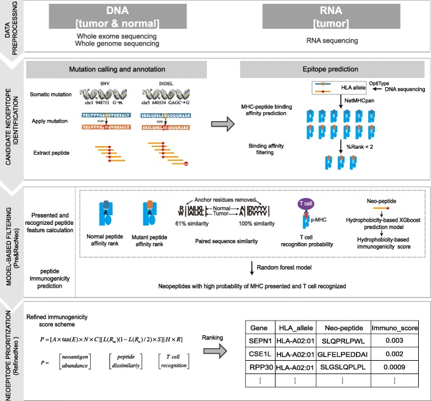

# pTuneos

Paper: [pTuneos: prioritizing tumor neoantigens from next-generation sequencing data](https://www.ncbi.nlm.nih.gov/pmc/articles/PMC6822339/) 

Code: [https://github.com/bm2-lab/pTuneos](https://github.com/bm2-lab/pTuneos)

The code is not very well written. The paper worth reading. 

It uses machine learning to first filter neoantigens using 5 features:

* MHC-I binding affinity for tumor (NetMHCpan)
* MHC-I binding affinity for normal (NetMHCpan)
* Self-sequence similarity between normal and mutant peptides
* Peptide hydrophobicity score of amino acids at T cell receptor (a strong hallmark of CD8+ T cell-mediated immunity)
* T cell recognition probability of the peptide-MHC complex (probability that a neoantigen will be recognized by the TCR repertoire, by alignment with a set of peptides retrieved from IEDB)

Then neoantigens are prioritized using a more refined score, calculated using additional features on top of the above:

* allele freq of mutate gene corresponding to the neotpitope
* expression
* clonality ("Cellular prevalence" = percentage of tumor cells containing the identified neoantigen, as output by /PyClone/)
* combined score of binding affinity, proteasomal C terminal cleavage, and TAP transport efficiency, as output by/NetCTLpan/    (Cleavage is when the 9-11 base long proteins are produced, TAP transport is when they are transported to the MHC complex)

Overall, there are 3 groups of features:

* Abundance (expression, AF, combined binding affinity+cleavage+transport efficiency, clonality)
* Peptide dissimilarity (Negative selection against cross-reacting T cells - MHC binding affinity)
* T cell recognition probability
		

Can reuse the learning/prioritization part of the code.

Also, it references other tools:

* pVAC - only MHC-I
* TSNAD  [https://www.ncbi.nlm.nih.gov/pmc/articles/PMC5414268/](https://www.ncbi.nlm.nih.gov/pmc/articles/PMC5414268/)   [https://github.com/jiujiezz/tsnad](https://github.com/jiujiezz/tsnad)  - uses MHC-II and also uses extracellular mutations of the membrane proteins
* Neopepsee (also machine learning, but claimed to consider fewer features)
* MuPeXI   [http://www.cbs.dtu.dk/services/MuPeXI/](http://www.cbs.dtu.dk/services/MuPeXI/) 

Also a paper that reviews MHC Class I and Class II prediction tools: [https://www.ncbi.nlm.nih.gov/pmc/articles/PMC6657809/](https://www.ncbi.nlm.nih.gov/pmc/articles/PMC6657809/) 
    

